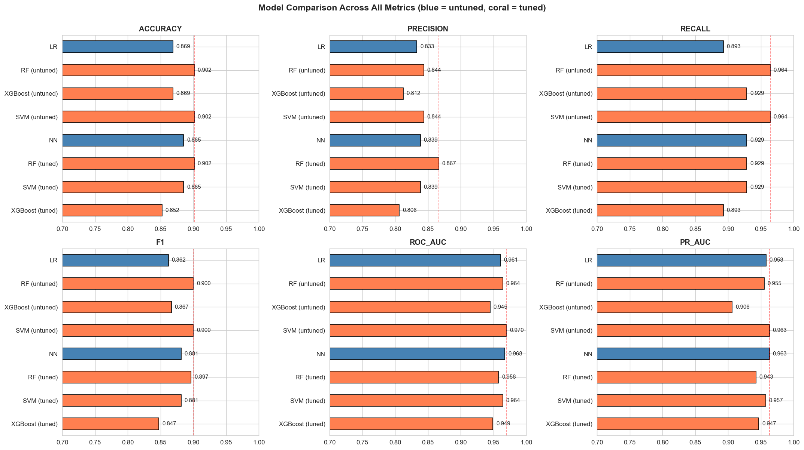
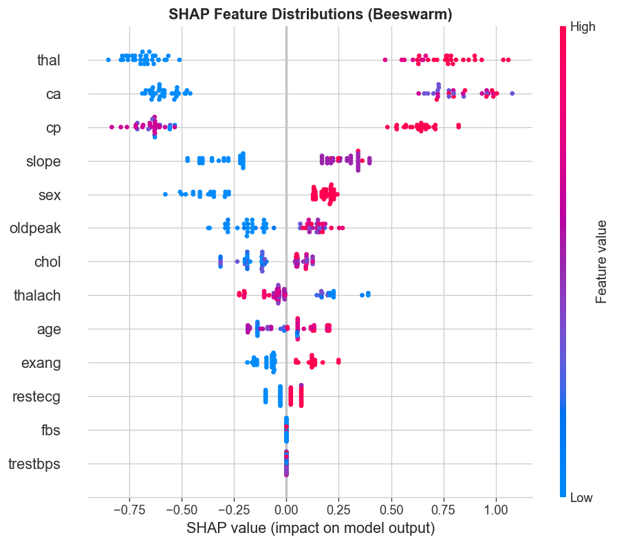
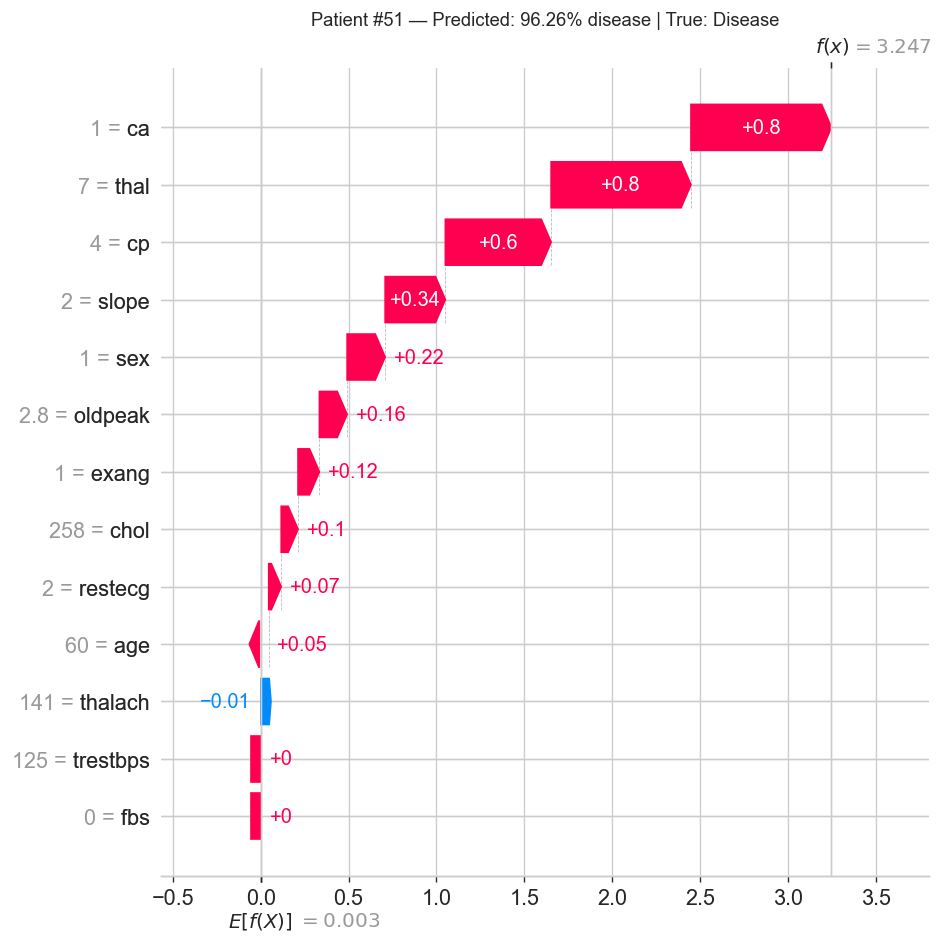
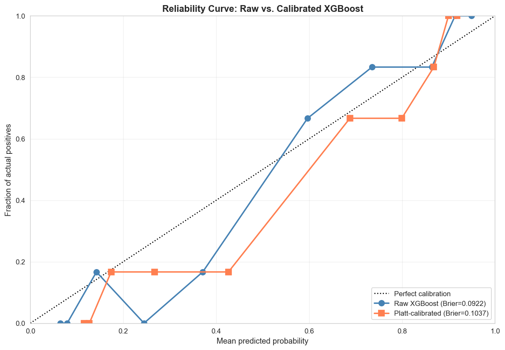
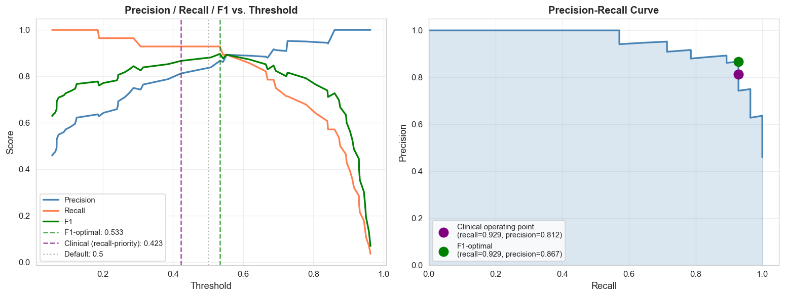

# Patient Risk Stratification Pipeline

[](https://www.python.org)
[](https://fastapi.tiangolo.com)
[](https://xgboost.readthedocs.io)
[](https://shap.readthedocs.io)
[](https://docker.com)
[](LICENSE)

End-to-end machine learning pipeline that predicts patient heart disease risk from clinical features. Built to demonstrate the full ML workflow: EDA, feature engineering, model selection, explainability, calibration, and containerized deployment.

---

## Headline Results

| Metric | Value |
|---|---|
| Test ROC-AUC (tuned XGBoost) | 0.95 |
| 5-fold CV ROC-AUC | 0.89 |
| Recall at clinical threshold | 0.93 |
| Precision at clinical threshold | 0.81 |
| Brier score (calibration) | 0.092 |
| Test set size | 61 patients |

Five model families compared (Logistic Regression, Random Forest, XGBoost, SVM, PyTorch NN). Tuned XGBoost selected for production due to favorable trade-offs in serving infrastructure, SHAP integration, and scaling behavior. Top three predictive features (`thal`, `ca`, `cp`) accounted for ~75% of feature importance and matched independent EDA correlations.

---

## Tech Stack

**ML & Data:** Python 3.13, pandas, numpy, scikit-learn, XGBoost, PyTorch, imbalanced-learn (SMOTE), SHAP, MLflow

**Serving:** FastAPI, Uvicorn, Pydantic

**Deployment:** Docker (multi-stage), uvicorn ASGI server

**Visualization:** matplotlib, seaborn

---

## Project Structure
patient-risk-stratification/
├── data/
│   ├── raw/                    UCI Heart Disease (Cleveland subset)
│   └── processed/              Train/test splits, post-SMOTE
├── notebooks/
│   ├── 01_eda.ipynb            Exploratory data analysis
│   ├── 02_modeling.ipynb       5 models trained, top 3 tuned
│   └── 03_shap_calibration.ipynb   SHAP + calibration analysis
├── src/
│   ├── app.py                  FastAPI service
│   └── schemas.py              Pydantic request/response models
├── models/                     Trained XGBoost + SHAP explainer
├── reports/figures/            Plots (SHAP, calibration, comparison)
├── Dockerfile                  Multi-stage production image
├── requirements.txt            Pinned dependencies
└── README.md

---

## Methodology

### 1. Exploratory Data Analysis
Dataset: UCI Heart Disease (Cleveland), 303 patients, 13 clinical features (plus binary target). Target reframed from 5-class severity to binary (disease vs. healthy) for clinical actionability. Distribution: 54% healthy / 46% disease. Demographic skew flagged (68% male) as a fairness concern requiring separate validation by sex before clinical use.

### 2. Preprocessing
Two parallel preprocessing tracks built to match each model family:
- **Tree track** (Random Forest, XGBoost): raw features, no scaling, no one-hot encoding
- **Linear track** (Logistic Regression, SVM, NN): one-hot categoricals (with `drop_first` to avoid the dummy variable trap), StandardScaler on numerical features

All preprocessing fit on training data only. Train/test split (80/20) stratified to preserve class balance. SMOTE applied to training data only, after the split, to prevent leakage. Median imputation for missing `ca` (1.32%) and `thal` (0.66%).

### 3. Modeling
Five model families trained and logged to MLflow with hyperparameters, metrics, and artifacts:
- Logistic Regression (baseline)
- Random Forest
- XGBoost
- SVM (RBF kernel)
- PyTorch feedforward NN (3 layers, dropout, ReLU)

Top three (RF, SVM, XGBoost) tuned via RandomizedSearchCV with 5-fold cross-validation. Final model selected for production based on a combination of CV score (honest generalization) and serving advantages (TreeExplainer for SHAP, scaling behavior, ecosystem).



### 4. Explainability — SHAP

SHAP TreeExplainer applied to the tuned XGBoost. Global feature importance and per-patient force plots generated.



The model independently rediscovered a counterintuitive clinical finding from EDA: patients reporting *asymptomatic* chest pain (cp=4) had the highest disease rates. This alignment between EDA and SHAP feature importance gave confidence the model was learning real clinical patterns rather than spurious noise.

Per-patient explanations available via the `/explain` API endpoint, enabling clinicians to verify any prediction:



### 5. Calibration & Threshold Tuning

Brier score evaluated to assess probability quality. The raw model achieved a Brier score of 0.092, already strong relative to the 0.25 baseline of a "predict 0.5 always" model. Platt scaling via 5-fold CV was tested but degraded Brier to 0.104, likely due to a combination of (a) the model already being near-calibrated, (b) CV variance on the small training set exceeding the calibration gain, and (c) non-monotonic deviation in the reliability curve that a single sigmoid cannot fully correct. The raw model is shipped with documented Brier and reliability curves; isotonic calibration on a held-out calibration set would be the next step with more data.



Three operating thresholds were evaluated:
- **Default 0.500**: precision 0.84, recall 0.93
- **F1-optimal 0.533**: precision 0.87, recall 0.93
- **Clinical 0.423** (recall-priority, precision ≥ 0.80): precision 0.81, recall 0.93

The clinical threshold maximizes recall under a precision-≥-0.80 constraint, appropriate for medical screening where false negatives (missed diagnoses) cost more than false positives (follow-up tests).



### 6. Deployment

FastAPI service exposes three endpoints:
- `GET /health` — service liveness
- `POST /predict` — patient features → disease probability + risk tier + clinical threshold applied
- `POST /explain` — patient features → prediction + per-feature SHAP contributions

Pydantic validates inputs against clinical ranges (age 18-100, BP 50-250, etc.) before reaching the model. OpenAPI/Swagger docs auto-generated at `/docs`.

The service is containerized via a multi-stage Dockerfile using a slim Python base, non-root user (`apiuser`), HEALTHCHECK directive, and `--chown` during multi-stage COPY to handle the multi-stage + non-root user permissions clash.

---

## Reproducing the Results

### Local (Python venv)

```bash
git clone https://github.com/Shrikant-Sharma/patient-risk-stratification.git
cd patient-risk-stratification
python -m venv venv
.\venv\Scripts\Activate.ps1   # Windows
# source venv/bin/activate    # Mac/Linux
pip install -r requirements.txt
```

Run the notebooks in order: `01_eda.ipynb` → `02_modeling.ipynb` → `03_shap_calibration.ipynb`.

Launch the API:
```bash
uvicorn src.app:app --reload --port 8000
```

Then visit http://localhost:8000/docs.

### Docker

```bash
docker build -t patient-risk-api:1.0 .
docker run -d --name patient-risk-api -p 8000:8000 patient-risk-api:1.0
```

Then visit http://localhost:8000/docs.

---

## Lessons Learned

A few engineering issues debugged during build, included here because the diagnosis matters as much as the result:

**1. Feature-order training/serving skew.** XGBoost's JSON serialization stores feature names and validates order at inference. The training pipeline ordered numerical features before categoricals; the API initially sent them in natural data dictionary order, causing a 500 error on first POST. Fixed by aligning column order in the API. Production lesson: save column order alongside the model in metadata; don't trust hardcoded ordering.

**2. Multi-stage Docker + non-root user permissions clash.** Builder-stage dependencies came over with root ownership and 700 permissions; the non-root runtime user (`apiuser`) couldn't execute uvicorn. Fixed with `COPY --from=builder --chown=apiuser:apiuser`. Production lesson: when combining multi-stage builds with non-root users (both security best practices), ownership must be transferred explicitly during COPY.

**3. Calibration is a hypothesis, not a tool.** Platt scaling degraded Brier on this dataset despite intuition suggesting it would help. Three reasons: model was already near-calibrated, CV calibration variance on 262 training rows exceeded the calibration gain, and the reliability curve had non-monotonic deviation that a single sigmoid couldn't fully correct. Reported both metrics and shipped the raw model with documented reliability.

---

## Limitations

- **Test set size (n=61) is small.** AUC has ~0.02 standard error; differences <2% are statistical noise. CV scores are reported alongside test scores as the more honest generalization estimate.
- **Demographic skew (68% male).** Model performance should be validated separately on female patients before any clinical deployment.
- **Single-source dataset.** UCI Heart Disease (Cleveland subset) is well-studied and clean. Real clinical data has substantially more missingness, more heterogeneous quality, and feature drift over time. Production deployment would require ongoing model monitoring and retraining triggers.

---

## Future Work

- **Agentic explanation layer** with LangGraph for natural-language clinical summaries
- **Survival analysis** (Cox PH, Kaplan-Meier) for time-to-event modeling
- **Causal inference** (propensity score matching, DoWhy) for treatment-effect estimation
- **Larger dataset** integration (NHANES, MIMIC subsets) to enable deeper validation
- **Model monitoring** with drift detection and automated retraining triggers

---

## License

MIT — see [LICENSE](LICENSE).

---

## Contact

[Shrikant Sharma](https://www.linkedin.com/in/shrikant-sharma) · GitHub: [@Shrikant-Sharma](https://github.com/Shrikant-Sharma)
